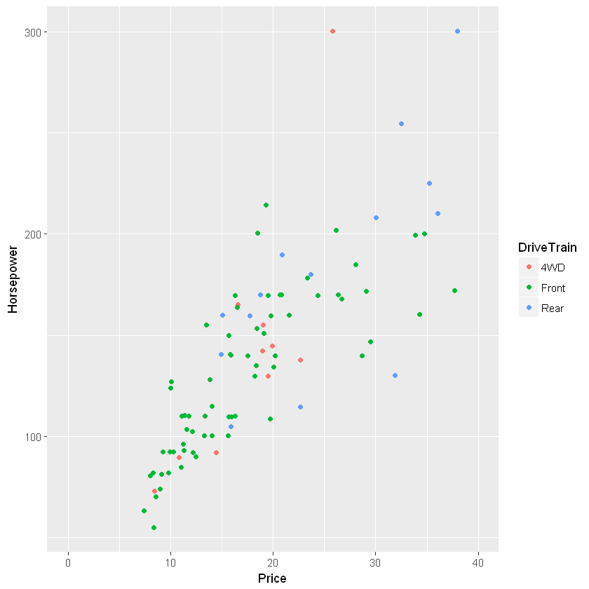

## 0. 기본 그래프 만들기
<pre>
실습해 보기
</pre>


```R
library(ggplot2)
library(MASS)
data("Cars93")   #  MASS 패키지에서 Cars93 데이터를 가져온다. 
```


```R
head(Cars93)
```


<table>
<thead><tr><th scope=col>Manufacturer</th><th scope=col>Model</th><th scope=col>Type</th><th scope=col>Min.Price</th><th scope=col>Price</th><th scope=col>Max.Price</th><th scope=col>MPG.city</th><th scope=col>MPG.highway</th><th scope=col>AirBags</th><th scope=col>DriveTrain</th><th scope=col>...</th><th scope=col>Passengers</th><th scope=col>Length</th><th scope=col>Wheelbase</th><th scope=col>Width</th><th scope=col>Turn.circle</th><th scope=col>Rear.seat.room</th><th scope=col>Luggage.room</th><th scope=col>Weight</th><th scope=col>Origin</th><th scope=col>Make</th></tr></thead>
<tbody>
	<tr><td>Acura             </td><td>Integra           </td><td>Small             </td><td>12.9              </td><td>15.9              </td><td>18.8              </td><td>25                </td><td>31                </td><td>None              </td><td>Front             </td><td>...               </td><td>5                 </td><td>177               </td><td>102               </td><td>68                </td><td>37                </td><td>26.5              </td><td>11                </td><td>2705              </td><td>non-USA           </td><td>Acura Integra     </td></tr>
	<tr><td>Acura                 </td><td>Legend                </td><td>Midsize               </td><td>29.2                  </td><td>33.9                  </td><td>38.7                  </td><td>18                    </td><td>25                    </td><td>Driver &amp; Passenger</td><td>Front                 </td><td>...                   </td><td>5                     </td><td>195                   </td><td>115                   </td><td>71                    </td><td>38                    </td><td>30.0                  </td><td>15                    </td><td>3560                  </td><td>non-USA               </td><td>Acura Legend          </td></tr>
	<tr><td>Audi              </td><td>90                </td><td>Compact           </td><td>25.9              </td><td>29.1              </td><td>32.3              </td><td>20                </td><td>26                </td><td>Driver only       </td><td>Front             </td><td>...               </td><td>5                 </td><td>180               </td><td>102               </td><td>67                </td><td>37                </td><td>28.0              </td><td>14                </td><td>3375              </td><td>non-USA           </td><td>Audi 90           </td></tr>
	<tr><td>Audi                                                 </td><td><span style=white-space:pre-wrap>100    </span>      </td><td>Midsize                                              </td><td>30.8                                                 </td><td>37.7                                                 </td><td>44.6                                                 </td><td>19                                                   </td><td>26                                                   </td><td>Driver &amp; Passenger                               </td><td>Front                                                </td><td>...                                                  </td><td>6                                                    </td><td>193                                                  </td><td>106                                                  </td><td>70                                                   </td><td>37                                                   </td><td>31.0                                                 </td><td>17                                                   </td><td>3405                                                 </td><td>non-USA                                              </td><td><span style=white-space:pre-wrap>Audi 100     </span></td></tr>
	<tr><td>BMW               </td><td>535i              </td><td>Midsize           </td><td>23.7              </td><td>30.0              </td><td>36.2              </td><td>22                </td><td>30                </td><td>Driver only       </td><td>Rear              </td><td>...               </td><td>4                 </td><td>186               </td><td>109               </td><td>69                </td><td>39                </td><td>27.0              </td><td>13                </td><td>3640              </td><td>non-USA           </td><td>BMW 535i          </td></tr>
	<tr><td>Buick             </td><td>Century           </td><td>Midsize           </td><td>14.2              </td><td>15.7              </td><td>17.3              </td><td>22                </td><td>31                </td><td>Driver only       </td><td>Front             </td><td>...               </td><td>6                 </td><td>189               </td><td>105               </td><td>69                </td><td>41                </td><td>28.0              </td><td>16                </td><td>2880              </td><td>USA               </td><td>Buick Century     </td></tr>
</tbody>
</table>


```R
Basic_Plot <- ggplot( Cars93, aes(x=Price, y=Horsepower)) +   
         # x축: 차량 가격, y축: 마력, Basic_Plot 변수 안에 그래프 정보를 저장
  geom_jitter(aes(colour=DriveTrain))    
         # jitter plot을 그립니다. 색상: 차량 구동계

Basic_Plot
```


### 1. 타이틀(Title) 커스텀하기

<pre>
타이틀의 내용을 변경해 보자.

ggtitle() 함수를 통해 입력이 가능하다. theme() 함수를 통해 설정 진행.
</pre>


```R
Basic_Plot + ggtitle("Jitter Plot for Cars93 Dataset") 
```


```R
Basic_Plot + ggtitle("Jitter Plot for Cars93 Dataset") 
           + theme(plot.title = element_text(family = "serif",  # 글씨체
                                             face = "bold",     # 글씨 모양 
                                             hjust=0.5,         # 가운데 정렬
                                             size=15,           # 크기
                                             color="darkblue")) # 색상 설정
```


    Error in inherits(x, "theme"): 기본값이 없는 인수 "e2"가 누락되어 있습니다
    Traceback:
    

    1. `+.gg`(theme(plot.title = element_text(family = "serif", face = "bold", 
     .     hjust = 0.5, size = 15, color = "darkblue")))

    2. add_theme(e1, e2, e2name)

    3. is.theme(t2)

    4. inherits(x, "theme")


```R
Basic_Plot + ggtitle("Jitter Plot for Cars93 Dataset \n coloring with Drive Train")  # title 명칭을 두 줄로 입력합니다. 
```


### Theme (A.a = element_b() )

###  A는 plot, pannel, axis 등 디자인을 변경할 가장 큰 구성이 들어간다.
###  그 다음 그 구성의 어떤 부분 (예를 들어 title, background 등) 을 바꿀 것인지 a에 지정하여 설정
### 어떤 구성에서 어떤 부분을 정할 것인지 지정했으면, element_b를 통해 한번 더 구체화
### element_는 항상 고정이며, b에는 rect, line, text, blank가 적용
### rect은 '사각형의' 라는 뜻을 지닌 'rectangular'의 약자

theme(plot.title = element_text(size = 3))

## 글자 크기, 글자 색깔, 중앙 정렬
<font size=4>
<pre>
글자 크기 : 15 ==>  size = 15
color darkblue ==>  color = darkblue
hjust 중앙정렬 ==>  hjust = 0.5
</pre>
</font size>


```R
Basic_Plot + ggtitle("Jitter Plot for Cars93 Dataset \n coloring with Drive Train") +  # title 명칭을 두 줄로 입력합니다. 
      theme(plot.title = element_text(size=15 , 
                                      color = "darkblue",
                                      hjust=0.5))   ### 사이즈     
```


## 축 타이틀을 바꾸어 보기

### 기본 그래프의 축 타이틀인 "Price", "Horsepower"를 다른 타이틀로 바꿔봅니다.
### 축 타이틀을 입력하는 함수는 labs() 함수입니다.
### X, Y 축에 대해 타이틀 수정이 가능합니다.


```R
Basic_Plot + labs(x="최대 최소 가격 평균", y="최대 마력")   # 축의 타이틀을 변경합니다.
ggsave("axis_title_name_change.jpg", dpi = 300)   
```


    Saving 6.67 x 6.67 in image
    


## 축 표현 범위 조정

## X축 0~60  ==>  0~40 으로 조정.
<pre>
경고 문구가 나타나는 경우는 데이터 표현 범위를 제한했기 때문이다.
</pre>


```R
Basic_Plot + lims(x=c(0,40))   # x축을 0에서 40
```

    Warning message:
    "Removed 3 rows containing missing values (geom_point)."





## 축 레벨 잘게 쪼개기

## 축 레벨을 쪼개기 위해 
## scale_x_continus() 함수
## scale_y_continuous() 함수를 이용

## argument 중 breaks를 통해 원하는 형태로 라벨을 쪼개기


```R
Basic_Plot + scale_x_continuous(breaks = c(10,20,30,40,50,60))   # x축을 10단위로 쪼갭니다.
ggsave("axis_breaks.jpg", dpi = 300)   # ggplot를 저장합니다.
```


    Saving 6.67 x 6.67 in image
    


### 축 라벨 바꾸기

### X축인 Price를 좀 더 잘 설명하기 위해 라벨에 "$"를 붙여서 바꿔주는 예제를 진행.


```R
Basic_Plot + scale_x_continuous(breaks = c(10,20,30,40,50,60), 
                                labels = paste0("$",c(10,20,30,40,50,60))) # x축을 10단위로 쪼갭니다. 앞에 $를 붙여서 라벨 명칭 변경 
```


## 축 라벨 옆으로 눕히기

### X축인 Price를 좀 더 잘게 쪼개고 "$"를 붙인 후에 이를 90도 회전하여 보여준다.
### 라벨의 입력이 아닌 형태를 바꾸는 부분에서 theme() 함수를 사용


```R
Basic_Plot + scale_x_continuous(breaks = c(c(1:12)*5), 
                                labels = paste0("$",c(c(1:12)*5))) +   
    # x축을 5단위로 쪼갭니다. 앞에 $를 붙여서 라벨 명칭을 바꿉니다. 
  theme(axis.text.x = element_text(angle = 90, hjust = 1, vjust = 0.5 ))   
   # x축 라벨을 옆으로 눕힙니다.
```


## 축 위치 바꾸기

## X축을 위로 바꿔보기
## Y축을 우측으로 변경해 보기 


```R
Basic_Plot + scale_x_continuous(position = "top")   # x축을 위로 옮깁니다.
```


### 범례 위치 바꾸기

## 범례는 theme() 함수를 통해 위치를 바꾸어주어야 한다.


```R
Basic_Plot + theme(legend.position = "top")   # 범례 위치를 지정
```


## 범례 위치를 그래프 안으로 넣기


```R
Basic_Plot + theme(legend.position = c(0.85, 0.2))   # 범례 위치를 그래프 내부로 설정
Basic_Plot + theme(legend.position = c(0.2, 0.2))   # 범례 위치를 그래프 내부로 설정
```


```R
Basic_Plot + theme(legend.position = c(0.85, 0.2))   # 범례 위치를 그래프 내부로 설정
Basic_Plot + theme(legend.position = c(0.85, 0.7))   # 범례 위치를 그래프 내부로 설정
```


###  그래프 안에 글자/선/도형 넣기

### annotate() 함수를 이용하여 가능하다.
### 한 번에 여러 개의 항목을 추가할 수 있고, 도형 위에 글자나 선을 넣는 것도 가능함.


```R
Basic_Plot + annotate("text", x = 52, y = 100, label = "Price Limit\nLine") +   # plot에 글자를 추가 
  annotate("text", x = 10, y = 230, label = "Candidate \nGroup") +   # plot에 글자를 추가
  annotate("rect", xmin = 0, xmax = 40, ymin = 0, ymax = 250, alpha = .2, fill="skyblue") +   # plot에 사각형을 추가
  annotate("segment", x = 60, xend = 60, y = 0, yend = 300, colour = "black", size=1)   # plot에 선을 추가
ggsave("plot_annotate.jpg", dpi = 300)   # ggplot를 저장합니다.
```


    Saving 6.67 x 6.67 in image
    


### 그래프의 X축, Y축을 바꿔 그리기
### coord_flip() 함수 이용


```R
Basic_Plot + coord_flip()   # x축, y축을 바꿔서 그립니다. 
```


### 흑백으로 나타내기
### scale_colour_grey() 함수 이용


```R
Basic_Plot +  scale_colour_grey()   # 흑백으로 나타내기
```


### 팔레트 적용
### scale_color_brewer() 함수 이용
참조 : http://www.cookbook-r.com/Graphs/Colors_(ggplot2)/#a-colorblind-friendly-palette


```R
Basic_Plot +  scale_color_brewer(palette = "Dark2")  # Dark2 팔레트를 적용
```


### 원하는 색상 적용
### scale_color_manual()
### 직접 자신이 원하는 색상을 입력하여 변경해 보기
### 색상 값의 수가 범례의 항목 수와 동일해야 한다.
### 입력한 색상의 수가 범례의 항목 수와 다를 경우 에러가 나면서 변경이 적용 안됨.


```R
Basic_Plot +  scale_color_manual(values = c("dodgerblue4", "darkorchid3", "goldenrod1"))  # 원하는 색상으로 표현
```


### 테마 적용하기 - ggthemes
참조 URL : https://cran.r-project.org/web/packages/ggthemes/vignettes/ggthemes.html


```R
library(ggthemes)
Basic_Plot +  scale_color_economist() + theme_economist()   # economist 테마를 적용
```


```R
Basic_Plot +  theme_hc(bgcolor = "darkunica") + scale_colour_hc("darkunica")   # darkunica 색상의 Highcharts 테마를 적용
```


### <참조>

http://ggplot2.tidyverse.org/reference/ <br>
http://zevross.com/blog/2014/08/04/beautiful-plotting-in-r-a-ggplot2-cheatsheet-3/#use-a-new-theme-theme_xx  <br>
https://cran.r-project.org/web/packages/ggthemes/vignettes/ggthemes.html  <br>


```R

```


```R

```
