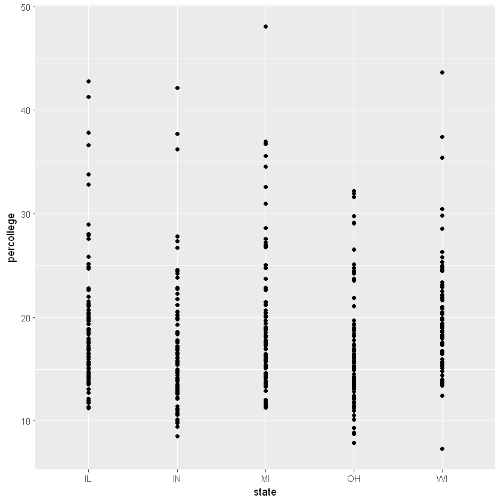
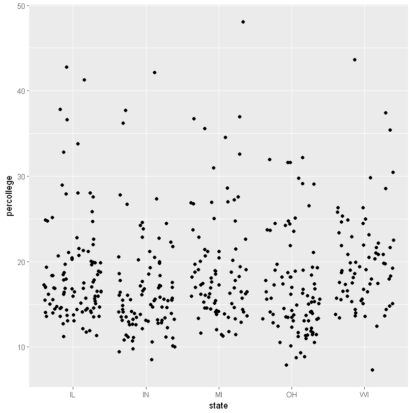
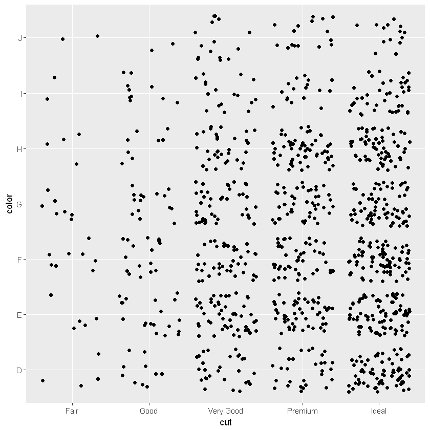
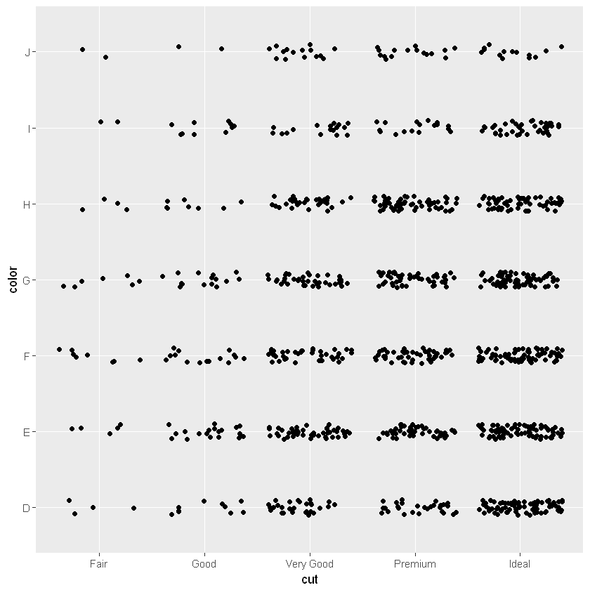
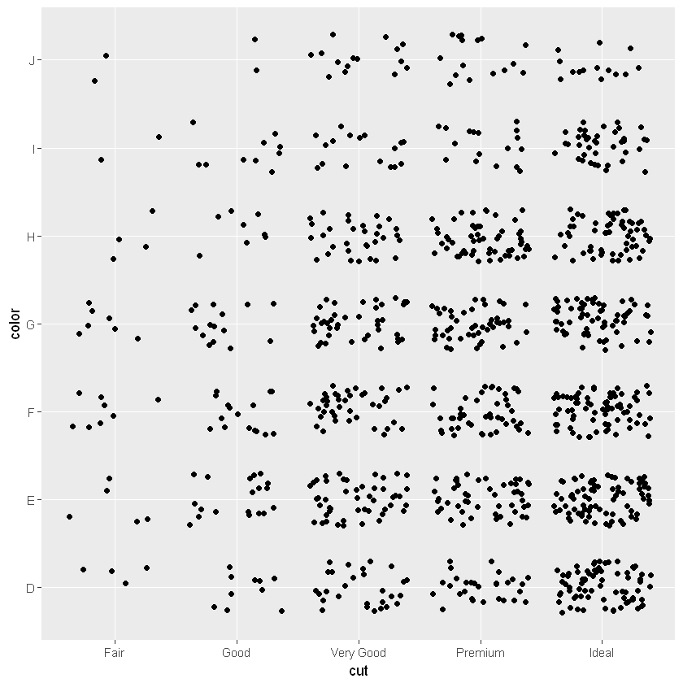
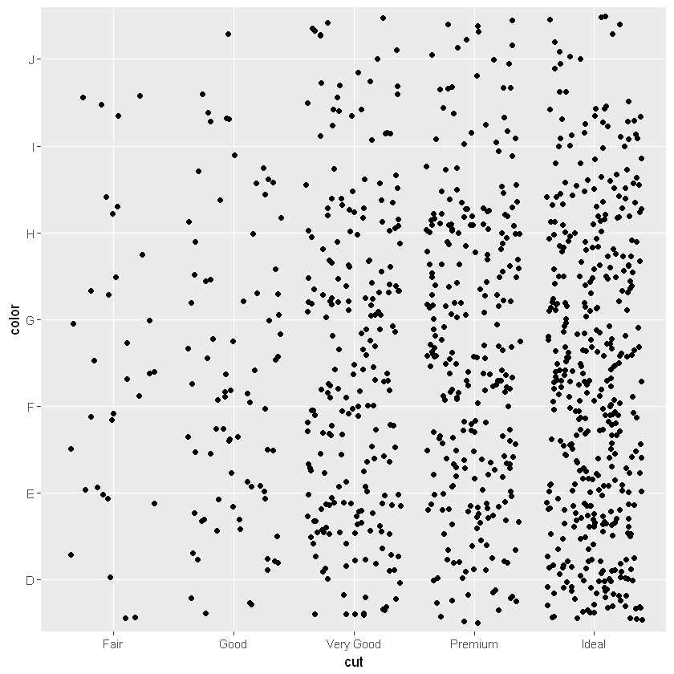
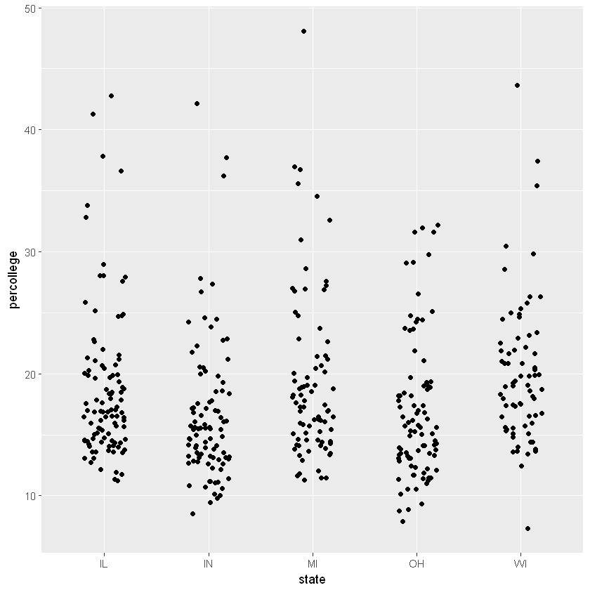
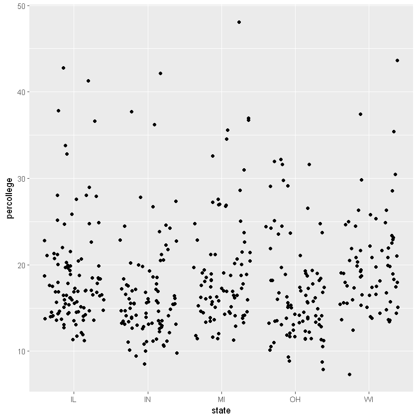
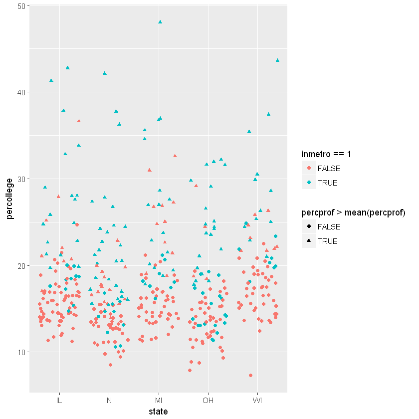
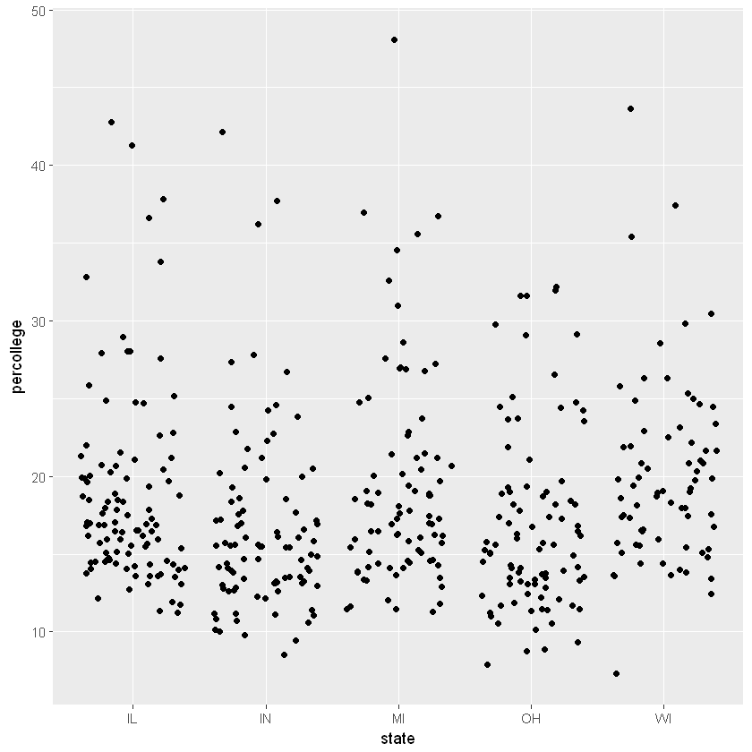

## geom_jitter

### geom_point에서 각각의 점의 위치를 범위 내에서 무작위로 수평분산 시킨다.


```R
library(ggplot2)
```

### 미국 중서부 5개 주 카운티를 대상으로 지역정보를 조사한 midwest 데이터

<pre>
poptotal    :   전체 인구
popdensity  :   인구 밀도
popwhite    :   백인의 수.
popblack    :   흑인의 수.
popamerindian  :  아메리칸 인디언 수.
popasian    :   아시아 인의 수.
popother    :   다른 종족의 수.
percwhite   :   백인의 비율(백분율)
percblack   :   흑인의 비율(백분율)
percamerindan  :  아메리카 인디언의 비율
percasian   :   아시아인의 비율 
percother   :   다른 인종의 비율 
popadults   :   성인의 수
perchsd
percollege  : 학사
대학교육을 받은 비율
percprof    :  전문인 비율
poppovertyknown
percpovertyknown
percbelowpoverty
percchildbelowpovert
percadultpoverty
percelderlypoverty
inmetro
In a metro area.
</pre>


```R
head(midwest)
```


<table>
<thead><tr><th scope=col>PID</th><th scope=col>county</th><th scope=col>state</th><th scope=col>area</th><th scope=col>poptotal</th><th scope=col>popdensity</th><th scope=col>popwhite</th><th scope=col>popblack</th><th scope=col>popamerindian</th><th scope=col>popasian</th><th scope=col>...</th><th scope=col>percollege</th><th scope=col>percprof</th><th scope=col>poppovertyknown</th><th scope=col>percpovertyknown</th><th scope=col>percbelowpoverty</th><th scope=col>percchildbelowpovert</th><th scope=col>percadultpoverty</th><th scope=col>percelderlypoverty</th><th scope=col>inmetro</th><th scope=col>category</th></tr></thead>
<tbody>
	<tr><td>561      </td><td>ADAMS    </td><td>IL       </td><td>0.052    </td><td>66090    </td><td>1270.9615</td><td>63917    </td><td>1702     </td><td>98       </td><td>249      </td><td>...      </td><td>19.63139 </td><td>4.355859 </td><td>63628    </td><td>96.27478 </td><td>13.151443</td><td>18.01172 </td><td>11.009776</td><td>12.443812</td><td>0        </td><td>AAR      </td></tr>
	<tr><td>562      </td><td>ALEXANDER</td><td>IL       </td><td>0.014    </td><td>10626    </td><td> 759.0000</td><td> 7054    </td><td>3496     </td><td>19       </td><td> 48      </td><td>...      </td><td>11.24331 </td><td>2.870315 </td><td>10529    </td><td>99.08714 </td><td>32.244278</td><td>45.82651 </td><td>27.385647</td><td>25.228976</td><td>0        </td><td>LHR      </td></tr>
	<tr><td>563      </td><td>BOND     </td><td>IL       </td><td>0.022    </td><td>14991    </td><td> 681.4091</td><td>14477    </td><td> 429     </td><td>35       </td><td> 16      </td><td>...      </td><td>17.03382 </td><td>4.488572 </td><td>14235    </td><td>94.95697 </td><td>12.068844</td><td>14.03606 </td><td>10.852090</td><td>12.697410</td><td>0        </td><td>AAR      </td></tr>
	<tr><td>564      </td><td>BOONE    </td><td>IL       </td><td>0.017    </td><td>30806    </td><td>1812.1176</td><td>29344    </td><td> 127     </td><td>46       </td><td>150      </td><td>...      </td><td>17.27895 </td><td>4.197800 </td><td>30337    </td><td>98.47757 </td><td> 7.209019</td><td>11.17954 </td><td> 5.536013</td><td> 6.217047</td><td>1        </td><td>ALU      </td></tr>
	<tr><td>565      </td><td>BROWN    </td><td>IL       </td><td>0.018    </td><td> 5836    </td><td> 324.2222</td><td> 5264    </td><td> 547     </td><td>14       </td><td>  5      </td><td>...      </td><td>14.47600 </td><td>3.367680 </td><td> 4815    </td><td>82.50514 </td><td>13.520249</td><td>13.02289 </td><td>11.143211</td><td>19.200000</td><td>0        </td><td>AAR      </td></tr>
	<tr><td>566      </td><td>BUREAU   </td><td>IL       </td><td>0.050    </td><td>35688    </td><td> 713.7600</td><td>35157    </td><td>  50     </td><td>65       </td><td>195      </td><td>...      </td><td>18.90462 </td><td>3.275891 </td><td>35107    </td><td>98.37200 </td><td>10.399635</td><td>14.15882 </td><td> 8.179287</td><td>11.008586</td><td>0        </td><td>AAR      </td></tr>
</tbody>
</table>


```R
head(midwest[,c('state', 'percollege')])
```


<table>
<thead><tr><th scope=col>state</th><th scope=col>percollege</th></tr></thead>
<tbody>
	<tr><td>IL      </td><td>19.63139</td></tr>
	<tr><td>IL      </td><td>11.24331</td></tr>
	<tr><td>IL      </td><td>17.03382</td></tr>
	<tr><td>IL      </td><td>17.27895</td></tr>
	<tr><td>IL      </td><td>14.47600</td></tr>
	<tr><td>IL      </td><td>18.90462</td></tr>
</tbody>
</table>


```R
# percollege변수는 각각의 카운티에서 대학교육을 받은 사람의 비율을 나타내고, 
# state는 중서부에 속한 다섯 개 주를 의미
ggplot(midwest, aes(state, percollege))+
  geom_point()
```





## 위와 같은 geom_point함수의 가독성 문제를 보완하기위에 geom_jitter함수를 사용


```R
ggplot(midwest, aes(state, percollege))+
  geom_jitter()
```





### 높이 조정


```R
# 총 넓어지는 범위는 height에 지정된 값의 두 배입니다. 디폴트 값은 0.4

dia<-diamonds[sample(1:length(diamonds$carat), 1000), ]

ggplot(dia, aes(cut, color))+
  geom_jitter()

ggplot(dia, aes(cut, color))+
  geom_jitter(height = 0.1)

ggplot(dia, aes(cut, color))+
  geom_jitter(height = 0.3)

ggplot(dia, aes(cut, color))+
  geom_jitter(height = 0.5)
```














### 너비 조정


```R
ggplot(midwest, aes(state, percollege))+
  geom_jitter(width = 0.2)

ggplot(midwest, aes(state, percollege))+
  geom_jitter(width = 0.4)
```








## color
## color 인수를 사용해 여러 조건들을 설정 가능


```R
ggplot(midwest, aes(state, percollege))+
  geom_jitter(data=midwest, aes(color=inmetro==1, 
                                shape=percprof>mean(percprof)))
```





### 대도시권에 속해있는 카운티의 색을 다르게 지정하고 
### 박사교육과정을 받은 비율이 평균보다 높은 카운티에는 모양을 변경

ggplot(midwest, aes(state, percollege))+
  geom_jitter()

ggplot(midwest, aes(state, percollege))+
  geom_point()


```R
ggplot(midwest, aes(state, percollege))+
  geom_jitter()

ggplot(midwest, aes(state, percollege))+
  geom_point()
```





### geom_point로 그래프를 출력한 경우 
### 두 번째 그래프처럼 점들의 간격이 좁을 경우 가독성이 떨어진다.

### geom_jitter의 경우, 
### 일정 범위 내에 흩뿌려 준다


```R

```
